 # 🎼 Bot de música discord 🦾
## Tópicos

1. Instalação
	1.1. Criação do bot
	1.2. Instalação de dependências
	1.3. instalação do FFMPEG
2. Configuração do bot
3. Configuração do FaunaDB

## Instalação

### Criação do bot
Visite [esta página](https://discord.com/developers/applications) do discord para criar sua aplicação do discord. Após realizar o login, se dirija ao botão de criar uma nova aplicação.
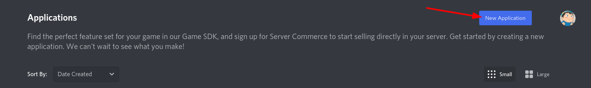

Adicione o nome do bot e clique em **create**.

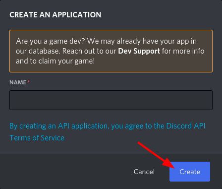

Logo após isso, estaremos em uma nova página, no canto esquerdo clique em **Bot** e na direita selecione **Add Bot**.
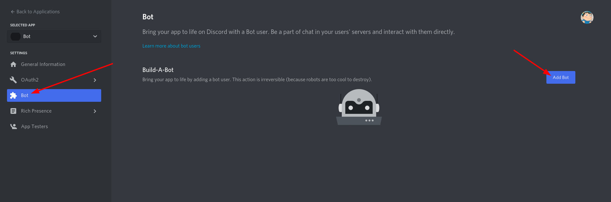

Agora na seção do canto esquerdo clique em **bot** e em **Privileged Gateway Intents** ligue todas as opções.
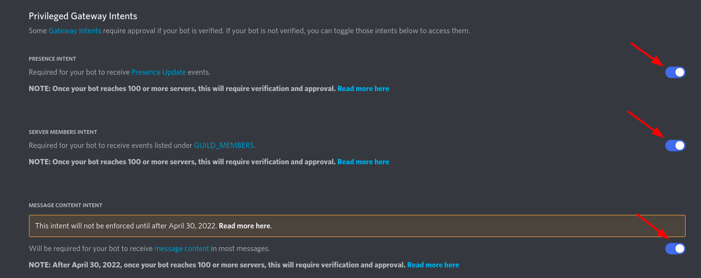

Agora com nosso bot criado, basta apenas adicioná-lo ao servidor desejado. Vá até, **OAuth2** --> **URL Generator**.
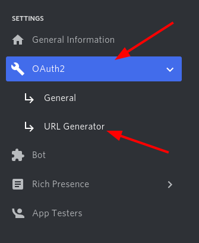

Em **scopes** selecione **_bot_** e em **_Bot permissions_** selecione **Administrator**.
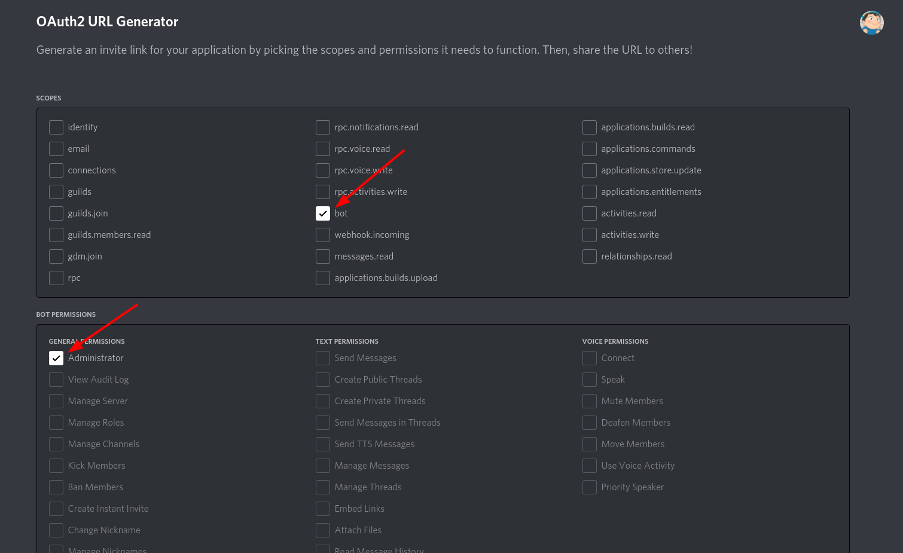

Agora, na parte de baixo da página surge uma URL, clique para copiar essa URL e cole na barra de cima do navegador para que você possa adicionar o seu bot no seu servidor do discord desejado.
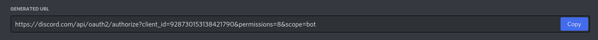

Copie a URL gerada e cole em uma aba do seu browser preferido, ao fazer isso irá abrir uma guia para você selecionar o servidor aonde o bot será adicionado, após isso clique em **Continuar**.
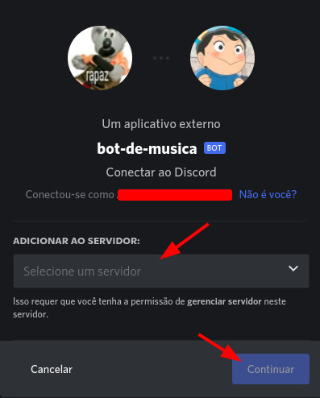

Por último você vai clicar em  **Autorizar** para que o bot entre no servidor com as permissões dadas a ele. 
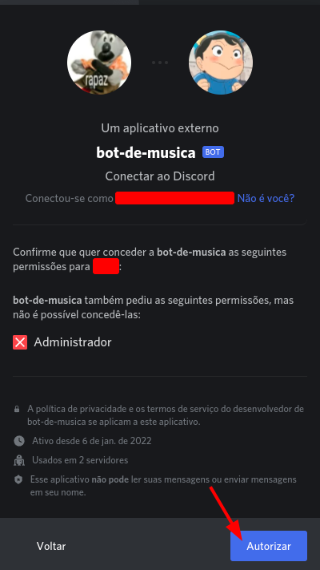

### 1.2 Instalação de dependências

Para que o bot funcione, um de seus pré-requisitos é ter o [python](https://www.python.org/) instalado em máquina juntamente ao pip (gerenciador de pacotes do python), observe que para que o pip funcione corretamente o caminho do pip deve estar corretamente adicionado à variável PATH do sistema, o que por vezes não vem por padrão e o usuário deve fazer manualmente. Com o python e o pip devidamente instalados, abra e terminal e, dentro da pasta do repositório execute:

`pip install -r requirements.txt`

Com isso, o pip irá instalar todas as dependências necessárias ao devido uso da aplicação.

### 1.3 Instalação do FFMPEG
Para a instalação do FFMPEG visite o [site oficial](https://www.ffmpeg.org/download.html) e siga o tutorial para baixar e instalar em Linux ou execute os seguintes comandos no terminal:

`sudo add-apt-repository ppa:mc3man/trusty-media`
`sudo apt-get update | sudo apt-get upgrade | sudo apt-get install ffmpeg`

Caso esteja em Windows, tente seguir [este](https://windowsloop.com/install-ffmpeg-windows-10/) tutorial.

## Configuração do bot:
Para que seu programa reconheça o bot que você criou anteriormente basta resgatar seu token que fica no [site do discord](https://discord.com/developers/applications).

Na barra da esquerda clique em bot e depois na direita clique em Click to reveal token, basta copiar seu token e colar no lugar indicado dentro do arquivo .env que fica dentro da pasta app do repositório e seu bot funcionará corretamente.

Agora com o bot configurado basta executar o arquivo **main.py** e se tudo estiver certo o bot se mostrará ligado no servidor.

(Todos os bots de discord têm algum prefixo pelo qual os usuários podem chamá-lo, geralmente são usados caracteres especiais como !, +, $, !!, u! e etc. Por padrão este bot utiliza do $, mas você pode modificar o arquivo nomeado de config.yml que fica dentro de app/config para definir seu prefixo do bot.)

## Configuração do FaunaDB
O banco de dados utilizado no projeto é o [FaunaDB](https://fauna.com/) que é fornecido como uma API na nuvem segura e escalável com GraphQL nativo.
Crie uma conta e nela usaremos o plano grátis que será o suficiente para guarda os nomes das músicas. 
Após realizar o login, se dirija ao botão de criar uma novo banco de dados.

Adicione o nome do banco de dados , selecione o **Region Group** como **_Classic (C)_** e clique em **Create**.
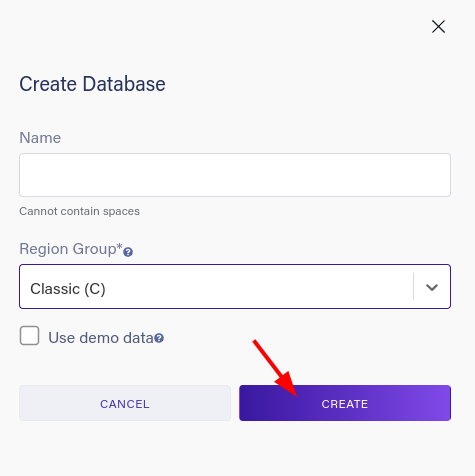

Logo após isso, estaremos em uma nova página, no canto esquerdo clique em **Security** e na direita selecione **NEW KEY**.
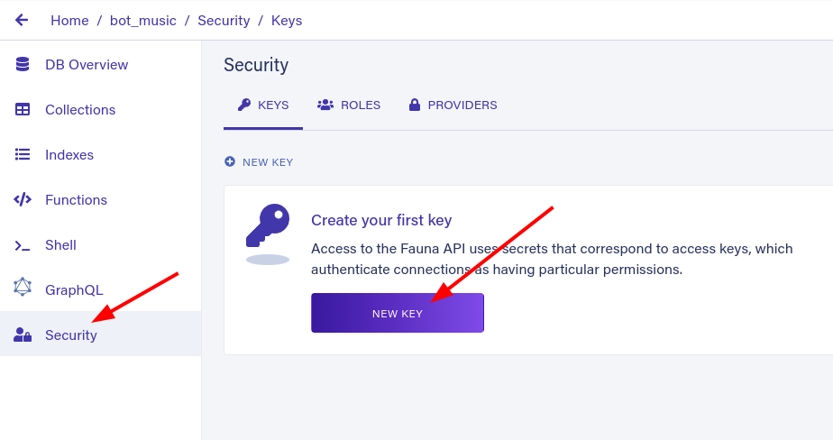

Não é necessário dar um nome para chave, então apenas clique em **SAVE** 
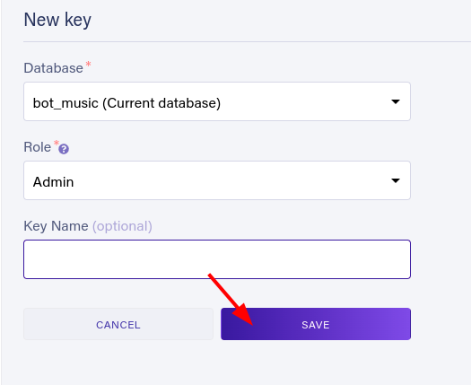

Agora copie a chave criada e adicione no arquivo .env aonde tem a parte do FAUNADB_KEY. Agora suas músicas serão salvas no banco.